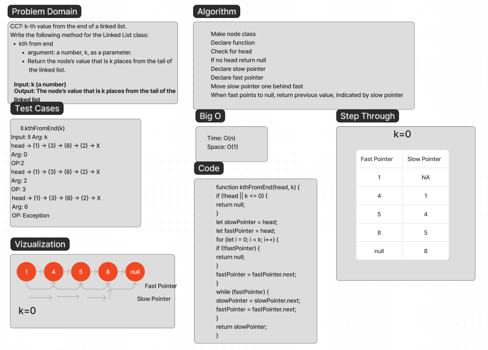

# Challenge 7 Linked List kth

Write a method to find the value of the node k numbers away from the end of the linked list.

## Whiteboard Process



## Approach & Efficiency

Make node class
Declare function
Check for head
If no head return null
Declare slow pointer
Declare fast pointer
Move slow pointer one behind fast
When fast points to null, return previous value, indicated by slow pointer

Time:O(n)
Space:O(1)

## Solution

```javascript
function kthFromEnd(head, k) {
  if (!head || k <= 0) {
    return null;
  }
  let slowPointer = head;
  let fastPointer = head;
  for (let i = 0; i < k; i++) {
    if (!fastPointer) {
      return null;
    }
    fastPointer = fastPointer.next;
  }
  while (fastPointer) {
    slowPointer = slowPointer.next;
    fastPointer = fastPointer.next;
  }
  return slowPointer;
}
const values = [1, 2, 3, 4, 5, 6, 7];
const k = 3;
const head = createLinkedList(values);
const kthNode = kthFromEnd(head, k);
if (kthNode) {
  console.log(`The ${k}th node from the end is: ${kthNode.value}`);
} else {
  console.log(`The list is too short to find the ${k}th node from the end.`);
}
```
